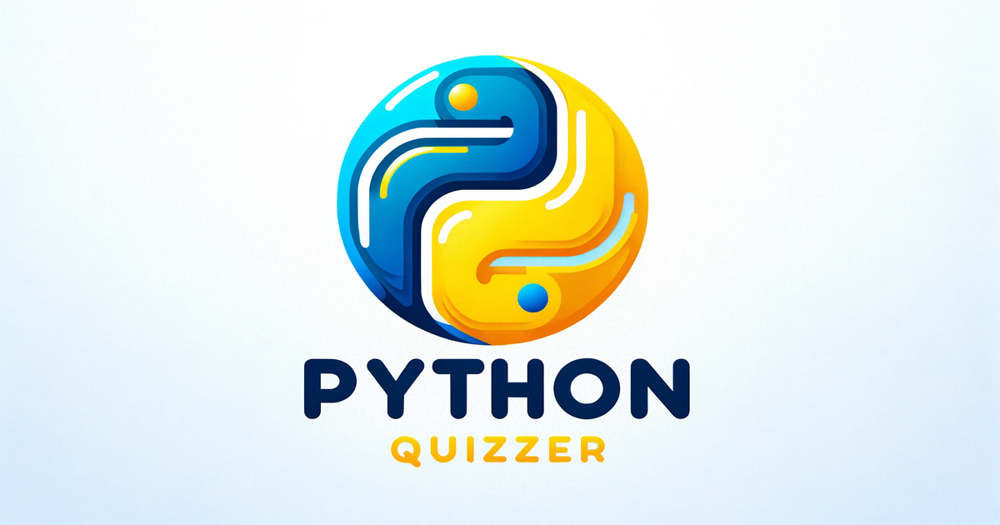

Welcome to the **Python Quizzer** - an interactive way to test and improve your Python skills! This is a hobby project built with React and TypeScript.

The quiz presents users with 20 random Python questions, each featuring a question, a code snippet, and six possible answers. After responding to a question, the game displays an explanation of the code.

Try the <a href="https://alexandengstrom.github.io/python-quizzer/">Python Quizzer!</a>

## Getting Started

To get started with this project, follow these steps:

1. **Clone the Repository**: Clone this repo to your local machine using:

```bash
git clone git@github.com:alexandengstrom/python-quizzer.git
```

2. **Install Dependencies**: Navigate to the project directory and install the required dependencies with npm install.

```bash
npm install
```

3. **Run the Project:** Start the project using npm run dev. This will launch the game in your default browser.

```bash
npm run dev
```

## Contributing

Contributions are encouraged, especially from those looking to make their first pull request. Here's how you can add your own questions or contribute in other ways.

To contribute, start by forking the repository. This creates a copy of the project in your GitHub account, allowing you to make changes without affecting the original project.

### Adding Questions

1. **JSON File**: Questions are stored in **data/questions.json**. The file structure is:

```json
{
  "beginner": [],
  "medium": [],
  "hard": [],
  "expert": []
}
```

2. **Question Format**: Add new questions using the correct format. Below is a well formatted question:

```json
{
  "difficulty": "beginner",
  "question": "What will be the output of the following Python code?",
  "codeSnippet": "list1 = [1, 2, 3]\nlist2 = list1\nlist2[0] = 4\nprint(list1)",
  "explanation": "In this code, 'list2' is not a copy of 'list1', but a reference to the same list object. Modifying 'list2' changes 'list1'. The output is '[4, 2, 3]'.",
  "correctAnswer": "[4, 2, 3]",
  "incorrectAnswers": ["[1, 2, 3]", "Error", "[1, 4, 3]", "None", "[4, 4, 4]"]
}
```

Make sure every question have a clear question, a code snippet and only one possible output.

3. **Validation**: Run **scripts/validate_json.py** to check the format of your JSON file before submitting a pull request. This script will also run automatically for every pull request so make sure your submission passes this test. You can try the script by running:

```bash
python3 scripts/validate_json.py
```

### Other Improvements

If you're skilled in TypeScript and React, feel free to improve the design and the user interface of the game. I am not an expert in this but I have have designed it as good as I could. I am sure you can do it better!

Currently, the project includes automated tests for validating the JSON file format. However, the rest of the codebase does not have accompanying tests. Contributions to develop tests for other parts of the code are highly welcome and appreciated!

## Report Issues

If you encounter any issues with the game or discover errors in the questions, you're encouraged to address the problem through a pull request. If you're unfamiliar with this process or prefer not to, please create an issue so that others may attempt to resolve it. Here's how you can do so:

1. Navigate to the 'Issues' tab in the GitHub repository.
2. Click on 'New Issue' to start reporting your problem.
3. Provide a descriptive title for your issue to help others understand the problem quickly.
4. In the description box, detail the issue you're experiencing. Be as specific as possible: include steps to reproduce the error, screenshots (if applicable), and any other information that might be relevant.
5. If known, suggest potential solutions or workarounds.
6. Once you've filled in all the details, click on 'Submit new issue' to post it.
